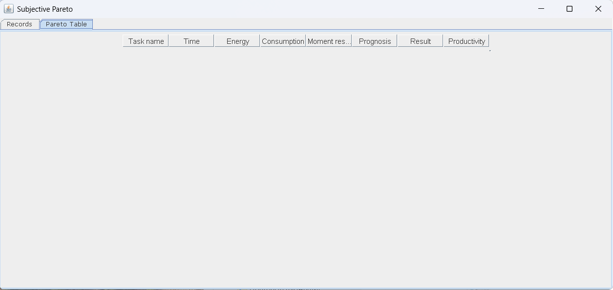
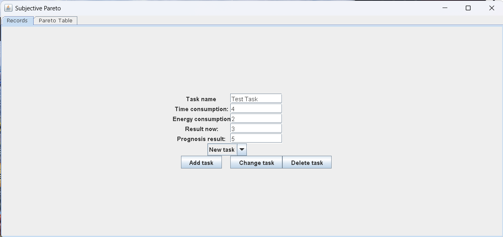
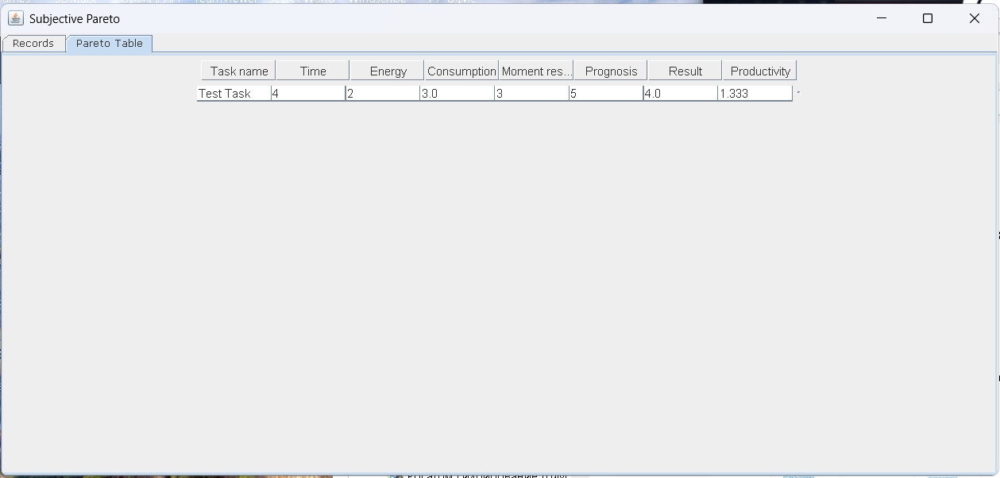

# Pareto

**Pareto** is a small Java Swing application for comparing tasks by their **subjective productivity**.

The idea is simple: different tasks require different amounts of time and energy, while also giving different levels of immediate and future value. This application helps the user compare such tasks using a compact personal productivity formula.

## Origin of the idea

This app was created as a small personal tool inspired by a real request from another person.  
Its purpose was to compare tasks not only by formal effort, but by subjective experience: how much time and energy they require, what they give now, and what they may give in the future.

## Quick Start

Make sure you have **Java 8** or newer installed.

Run the application with:

```bash
java -jar Pareto.jar
````

If you want to run the project from source code:

```bash
git clone https://github.com/RakhaHasse/Pareto.git
```

Then open the project in your Java IDE and run the application.

## Screenshots

### Main window



### Example with tasks



## Features

- Add tasks with custom parameters
- Estimate time and energy consumption
- Estimate current and expected future result
- Automatically calculate:
  - **Consumption**
  - **Result**
  - **Productivity**
- Compare several tasks in a table view

## How it works

Each task is described by the following values:

- **Task name**
- **Time consumption**
- **Energy consumption**
- **Now result**
- **Prognosis result**

The app then calculates three derived values.

### Consumption

Consumption is the average of time and energy costs:

```text
Consumption = (timeConsumption + energyConsumption) / 2
````

### Result

Result is the average of current and expected future benefit:

```text
Result = (nowResult + prognosisResult) / 2
```

### Productivity

Productivity is calculated as:

```text
Productivity = Result / Consumption
```

This allows the user to compare tasks not only by effort, but also by their perceived return.

## Example

Let us say you enter the following task:

* **Task name:** Reading
* **Time consumption:** 4
* **Energy consumption:** 2
* **Now result:** 3
* **Prognosis result:** 5

The app will calculate:

```text
Consumption = (4 + 2) / 2 = 3
Result = (3 + 5) / 2 = 4
Productivity = 4 / 3 = 1.33
```

## Project structure

```text
src/
 ├── Task.java
 ├── TasksList.java
 ├── TableModel.java
 └── Frame.java
Pareto.jar
README.md
LICENSE
```

## Main classes

### `Task`

Represents a single task and stores its parameters. Also calculates consumption, result, and productivity.

### `TasksList`

Stores and manages the collection of tasks.

### `TableModel`

Provides the table model for displaying task data in the interface.

### `Frame`

Contains the main Swing window and user interface logic.

## Requirements

To run the application you need:

* **Java 8** or newer

## Running the application

### Option 1 — Run the JAR file

If Java is installed, run:

```bash
java -jar Pareto.jar
```

### Option 2 — Run from source

1. Clone the repository:

```bash
git clone https://github.com/RakhaHasse/Pareto.git
```

2. Open the project in your IDE, for example:

* IntelliJ IDEA
* Eclipse
* NetBeans

3. Build and run the application

## How to use

1. Launch the application
2. Enter the task name
3. Fill in:

   * time consumption
   * energy consumption
   * now result
   * prognosis result
4. Add the task to the table
5. Repeat for other tasks
6. Compare the productivity values

## Purpose

This project is a small personal productivity tool. It is not intended as a scientific measurement system. Instead, it helps the user reflect on how worthwhile different activities feel subjectively.

It can be useful for:

* Self-analysis
* Comparing habits and routines
* Prioritizing personal tasks
* Reflecting on effort versus return

## Future improvements

Possible next steps for the project:

* Better input validation
* Editing existing tasks
* Saving and loading tasks from file
* Exporting results
* Improved UI design
* Stronger separation between UI and business logic
* Screenshots and demo examples in README

## License

* This project is licensed under the MIT License.
* README was prepared with the help of ChatGPT 5.4.
