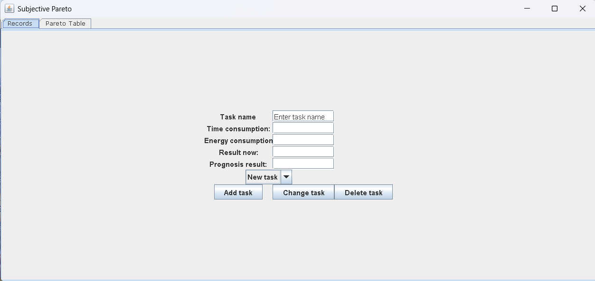

# Pareto

**Pareto** is a small Java desktop application for comparing tasks by their **subjective productivity**.

The idea is simple: different tasks require different amounts of time and energy, while also giving different levels of immediate and future value.  
This application helps the user compare such tasks using a compact personal productivity formula.

## Origin of the idea

This app was created as a small personal tool inspired by a real request from another person.

Its purpose was to compare tasks not only by formal effort, but by subjective experience: how much time and energy they require, what they give now, and what they may give in the future.

## Current status

Pareto is an evolving personal desktop tool.  
The project has grown from an early working prototype into a more structured Java application with:

- safer numeric input
- task sorting
- editable task records
- automatic field filling when an existing task is selected
- a more modular Swing-based structure

## Quick Start

Make sure you have **Java 11** or newer installed.

Run the application with:

```bash
java -jar Pareto.jar
````

If you want to run the project from source code:

```bash
git clone https://github.com/RakhaHasse/Pareto.git
```

Then open the project in your Java IDE and run the application.

## Screenshots

### Main window




### Example with tasks


## Features

* Add tasks with custom parameters
* Edit existing tasks
* Delete tasks
* Select an existing task and automatically fill form fields with its saved values
* Estimate:

  * time consumption
  * energy consumption
  * current result
  * expected future result
* Automatically calculate:

  * **Consumption**
  * **Result**
  * **Productivity**
* Sort tasks by productivity
* Compare tasks in a table view

## How it works

Each task is described by the following values:

* **Task name**
* **Time consumption**
* **Energy consumption**
* **Now result**
* **Prognosis result**

The app then calculates three derived values.

### Consumption

Consumption is the average of time and energy costs:

```text
Consumption = (timeConsumption + energyConsumption) / 2
```

### Result

Result is the average of current and expected future benefit:

```text
Result = (nowResult + prognosisResult) / 2
```

### Productivity

Productivity is calculated as:

```text
Productivity = Result / Consumption
```

This allows the user to compare tasks not only by effort, but also by their perceived return.

## Example

Let us say you enter the following task:

* **Task name:** Reading
* **Time consumption:** 4
* **Energy consumption:** 2
* **Now result:** 3
* **Prognosis result:** 5

The app will calculate:

```text
Consumption = (4 + 2) / 2 = 3
Result = (3 + 5) / 2 = 4
Productivity = 4 / 3 = 1.33
```

## Project structure

```text
src/
 ├── DigitsSchema.java
 ├── DigitsTextField.java
 ├── Frame.java
 ├── OptionsList.java
 ├── Record.java
 ├── Table.java
 ├── TableModel.java
 ├── Task.java
 ├── TasksList.java
Images/
Pareto.jar
README.md
LICENSE
```

## Main classes

### `Task`

Represents a single task and stores its parameters.
Also calculates consumption, result, and productivity.

### `TasksList`

Stores and manages the collection of tasks, including sorting and search operations.

### `Record`

Represents the record management panel for creating, editing, and deleting tasks.

### `OptionsList`

Handles task selection and automatic filling of form fields.

### `DigitsTextField`

Provides safer numeric text input for task parameters.

### `DigitsSchema`

Restricts text input to numeric values.

### `Table`

Displays task records in a table view.

### `TableModel`

Provides the table model for displaying task data in the interface.

### `Frame`

Contains the main application window and assembles the interface.

## How to use

1. Launch the application
2. Enter a new task or select an existing one
3. Fill in or edit:

   * time consumption
   * energy consumption
   * now result
   * prognosis result
4. Save the task
5. View the sorted task list in the table
6. Compare productivity values

## Purpose

This project is a small personal productivity tool.

It is not intended as a scientific measurement system.
Instead, it helps the user reflect on how worthwhile different activities feel subjectively.

It can be useful for:

* self-analysis
* comparing habits and routines
* prioritizing personal tasks
* reflecting on effort versus return

## Version notes

The project has evolved through several versions:

* **v1.0** — initial working release
* **v1.1** — improved stability for empty text fields
* **v1.2** — small structural and safety fixes
* **v1.3** — cleaner project structure and updated setup
* **v1.4** — automatic filling of task values after selection
* **v1.5** — improved sorting behavior and cleaner naming

## Future improvements

Possible next steps for the project:

* save/load tasks from file
* export results
* more flexible sorting and filtering
* improved UI design
* stronger separation between UI and business logic
* additional validation and status messages

## License

This project is licensed under the MIT License.

## Credits

README was prepared with the help of ChatGPT.
